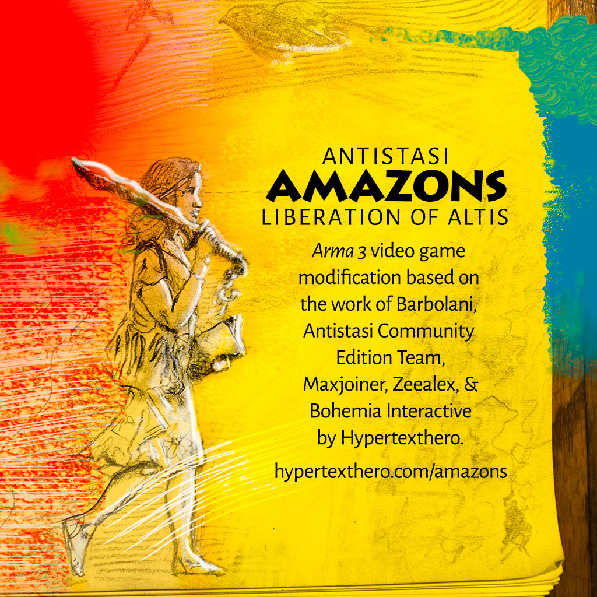

# Antistasi Amazons  

**Version 0.0.1** - 2020 June 12th  
*Antistasi Amazons* is currently based on [Antistasi Community Edition version 2.2.1][ascev].

[ascev]: https://github.com/official-antistasi-community/A3-Antistasi/releases/tag/2.2.1

***Antistasi Amazons*** is a basic modification (mod) of a dynamic long-term “Capture The Island” mission called ***[Antistasi][as]*** for the video game landscape orienteering and combat simulator *[Arma 3][a3]*. *Antistasi* was originally made by [Barbolani](https://www.youtube.com/user/barbolani/) and is now an open source [community-developed project][asc].

[a3]: https://www.bohemia.net/games/arma3
[as]: https://github.com/official-antistasi-community/A3-Antistasi
[asc]: https://github.com/official-antistasi-community/A3-Antistasi/graphs/contributors

## Features

- Uses two player-made client-side mods to add [women][w] to the game (the guerrillas you fight with), and lets you use a woman avatar.
- Adds a new rebel flag, introduction card, and map board card with the above illustration.
- Adds new briefing and overview text.
- Disables Arma’s [annoying][annoying] [stamina][st] mechanic.
- Adds a basic rifle and scope and removes one submachine gun from starting weapons.
- Uses standard *Arma 3* assets and its default **Altis** island map, a digital version of [Lemnos][lem].
- Sets saner mission parameter defaults to allow fast travel, reduce the number of weapons required for infinite unlocks to 10, and make enemy supply crate contents random.
- Playable in singleplayer or multiplayer modes.

## Installation

Please see [this blog post](https://hypertexthero.com/amazons) for installation instructions for both single and multiplayer modes.

[w]: https://en.wikipedia.org/wiki/Women_in_combat
[annoying]: https://community.bistudio.com/wiki/Arma_3_Stamina
[st]: https://www.washingtonpost.com/opinions/women-in-combat-roles-would-strengthen-the-military/2014/04/03/f0aeb140-bb50-11e3-9a05-c739f29ccb08_story.html 
[lem]: https://en.wikipedia.org/wiki/Lemnos

## Issues

- The hair of some of the female models in the [Max_women][fh] and [FEMAL3_Heads][mw] mods clip through hats and other head gear.
- When you take temporary control of an AI guerrilla and relinquish it after 60 seconds the AI character becomes your own avatar. 
- Bodies and voices.
  
[fh]: https://steamcommunity.com/workshop/filedetails/?id=374775446
[mw]: https://steamcommunity.com/workshop/filedetails/?id=1451755886

## Todo
  
- Add welcome sound to mission. First configure it in descriptions.ext, then [follow](https://community.bistudio.com/wiki/playSound3D) [these](https://steamcommunity.com/app/107410/discussions/0/143387886728301734/) [instructions](https://forums.bohemia.net/forums/topic/189498-solved-how-to-correctly-reference-a3-vanilla-sounds/).
- Add [random quotes](https://community.bistudio.com/wiki/BIS_fnc_selectRandom) function `_select1 = ["A", "B", "C", "D", "E"] call BIS_fnc_selectRandom;` and more updates to various mission texts.
- Eventually publish [on Steam](https://arma3.com/workshop101).

## Credits

- **[Antistasi](https://github.com/official-antistasi-community/A3-Antistasi)** by [Barbolani](https://www.youtube.com/user/barbolani/) and the [Antistasi Community Edition Team](https://github.com/official-antistasi-community/A3-Antistasi/graphs/contributors)
- **[Max_Women](https://steamcommunity.com/workshop/filedetails/?id=1451755886)** by [Maxjoiner](https://www.youtube.com/channel/UCPGvwaVtKMTa7EHrT-Ys4ww)
- **[FEMAL3_Heads](https://steamcommunity.com/workshop/filedetails/?id=374775446)** by [Zeealex](https://www.deviantart.com/zeealex)
- **[Arma 3](https://www.bohemia.net/games/arma3)** by [Bohemia Interactive](https://www.bohemia.net/)
- **Antistasi Amazons** basic mod by [Hypertexthero](https://hypertexthero.com).